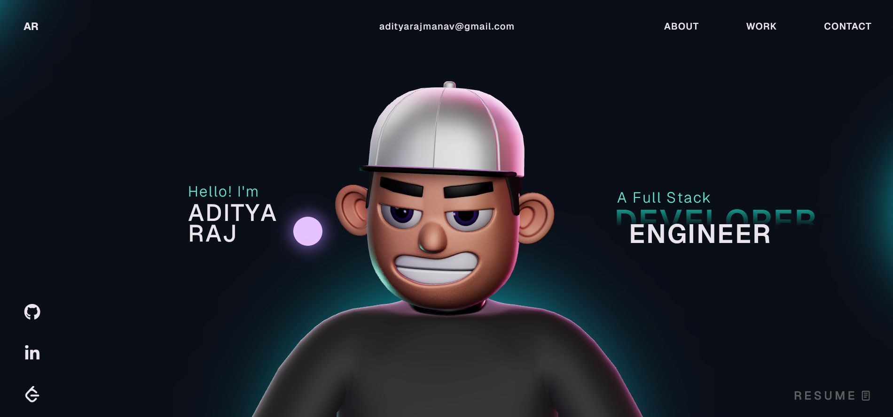

# Aditya Raj Portfolio

This repository contains my personal portfolio website built with React, TypeScript, GSAP, Three.js, and Vite.

## Features

- Personal intro, skills, experience, and achievements
- Project showcase with Live and GitHub links
- Resume, LinkedIn, GitHub, and LeetCode links
- Animated UI with GSAP and Three.js

## Tech Stack

- React
- TypeScript
- Vite
- GSAP
- Three.js
- HTML
- CSS

## Preview



## Run Locally

```bash
npm install
npm run dev
```

## Build

```bash
npm run build
```

## License

This project is available under the [MIT License](LICENSE).
